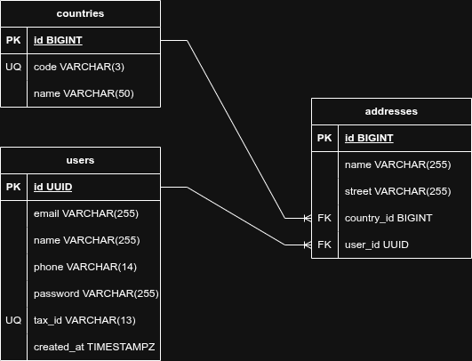

# Chakray - Technical Assessment


---

## Project Overview

Chakray is a **REST API** for managing **users and their addresses**, using a **Country Catalog** for normalized data.

The API supports **CRUD operations**, secure authentication with **JWT**, database versioning via **Liquibase**, and persistence on **PostgreSQL**.

### Key Features

- **User Management:** Create, Read, Update, Delete user profiles.
- **Addresses:** One user can have multiple addresses.
- **Country Catalog:** One country can be linked to multiple addresses.
- **Security:** Stateless authentication using **JWT** and AES-256 encryption for sensitive data.
- **Database Management:** Versioned migrations with **Liquibase**.

---

## Architecture

The project follows **Hexagonal Architecture**:

```
src/main/java/com/chakray/test/
├── domain/                 # Business entities and Ports (Interfaces)
│   ├── ports/in/           # Input Ports (Use Cases)
│   └── ports/out/          # Output Ports (Repository / Service interfaces)
├── application/            # Implementation of business services
└── infrastructure/         # External adapters
    ├── web/                # REST Controllers and DTOs
    ├── persistence/        # JPA Entities and Repositories
    ├── security/           # JWT and Encryption implementations
    └── config/             # Spring Boot configuration
```

---

## Security & Password Strategy

Sensitive data is handled via `PasswordEncoderPort`:

1. **PasswordHashAdapter:** One-way **BCrypt hashing** (for passwords).
2. **PasswordEncoderAesAdapter:** Reversible **AES-256 encryption** (for business-sensitive data).

> **Important:**
> By default, **AES-256** is used, allowing retrieval of original values if business rules require it.

---

## Technology Stack

- **JDK 17**, **Spring Boot 4.0.3**, **Maven 3.6.3**
- **Spring Data JPA** (PostgreSQL)
- **Spring Security & JWT**
- **Liquibase** (DB migrations)
- **MapStruct & Lombok**
- **Docker & Docker Compose**
- **JUnit & H2 Database** (testing)

---

## Database Schema

## 

## Prerequisites

1. Docker and Docker Compose installed.
2. `.env` file in the root directory (see `.env.example`).

---

## Quick Start – Development

1. Copy `.env.example` to `.env`:

```bash
cp .env.example .env
```

2. Fill in all **required values** (database user/password, JWT secret, AES key).

3. Launch the project with hot-reloading and managed PostgreSQL:

```bash
docker compose up --build
```

> The API will be available at `http://localhost:{APP_PORT}`

---

## Quick Start – Production

1. Build a production-ready Docker image:

```bash
docker build --platform linux/amd64 -t chakray-api:1.0.0 .
```

2. Run it with:

```bash
docker run -d --env-file .env -p 3000:3000 chakray-api:1.0.0
```

---

## Testing

Run tests in an **isolated H2 in-memory database**:

```bash
docker compose run --rm api ./mvnw test -Dspring.profiles.active=test
```

---

## Documentation

### API Access

**Base URL:**
[http://localhost:{APP_PORT}](http://localhost:{APP_PORT})

**Swagger UI:**
[http://localhost:{APP_PORT}/swagger-ui/index.html](http://localhost:{APP_PORT}/swagger-ui/index.html)

### Postman Collection

**Location:**
`/resources/chakray-test.postman_collection.json`
Contains all endpoints and environment variables for immediate testing.

---

## Environment Variables Overview

Only **required variables** are needed for production. Optional ones have defaults defined in `application.properties`.

### `.env.example` (Production Minimum)

```env
# Application
PORT=3000
APP_TIMEZONE=Indian/Antananarivo

# Database
POSTGRES_USER=your_db_user
POSTGRES_PASSWORD=your_db_password
POSTGRES_DB=chakray_api
POSTGRES_PORT=5432
DATABASE_URL=jdbc:postgresql://database:5432/${POSTGRES_DB}

# Security
APP_JWT_SECRET=your_jwt_secret_here
APP_PASSWORD_SECRET_KEY=your_aes256_secret_here
```

> **Note:** Fill in all `Yes/Required` variables before running in production.

### Full Environment Variables (Optional / Development)

### Application Settings

| Variable     | Description          | Default / Value     | Required |
| ------------ | -------------------- | ------------------- | -------- |
| PORT         | API Listening Port   | 3000                | No       |
| APP_TIMEZONE | Application Timezone | Indian/Antananarivo | No       |

---

### Database (PostgreSQL)

| Variable          | Description            | Default / Value                                | Required |
| ----------------- | ---------------------- | ---------------------------------------------- | -------- |
| POSTGRES_USER     | Username               | —                                              | Yes      |
| POSTGRES_PASSWORD | Password               | —                                              | Yes      |
| POSTGRES_DB       | Database Name          | —                                              | Yes      |
| POSTGRES_PORT     | Port                   | 5432                                           | No       |
| DATABASE_URL      | JDBC Connection String | jdbc:postgresql://database:5432/${POSTGRES_DB} | No       |

---

### Database Migration (Liquibase)

| Variable       | Description                      | Default / Value       | Required |
| -------------- | -------------------------------- | --------------------- | -------- |
| CHANGELOG_FILE | Initial Liquibase Changelog File | V[#num]\_\_[name].xml | Yes      |

---

### JPA / Hibernate

| Variable                 | Description         | Default / Value | Required |
| ------------------------ | ------------------- | --------------- | -------- |
| SPRING_JPA_SHOW_SQL      | Show SQL Statements | false           | No       |
| SPRING_JPA_FORMAT_SQL    | Format SQL Output   | false           | No       |
| SPRING_JPA_HIGHLIGHT_SQL | Highlight SQL       | false           | No       |

---

### Logging

| Variable                          | Description                       | Default / Value | Required |
| --------------------------------- | --------------------------------- | --------------- | -------- |
| LOGGING_LEVEL_ROOT                | Root Logging Level                | INFO            | No       |
| LOGGING_LEVEL_COM_CHAKRAY_TEST    | Application Package Logging Level | TRACE           | No       |
| LOGGING_LEVEL_ORG_SPRINGFRAMEWORK | Spring Framework Logging Level    | INFO            | No       |
| LOGGING_LEVEL_ORG_HIBERNATE       | Hibernate Logging Level           | INFO            | No       |

---

### Security – JWT

| Variable           | Description              | Default / Value    | Required |
| ------------------ | ------------------------ | ------------------ | -------- |
| APP_JWT_SECRET     | JWT Signing Secret Key   | —                  | Yes      |
| APP_JWT_EXPIRATION | JWT Expiration Time (ms) | 28800000 (8 hours) | No       |

---

### Security – Encryption

| Variable                | Description            | Default / Value | Required |
| ----------------------- | ---------------------- | --------------- | -------- |
| APP_PASSWORD_SECRET_KEY | AES-256 Encryption Key | —               | Yes      |

---

### API Documentation (SpringDoc)

| Variable                     | Description         | Default / Value | Required |
| ---------------------------- | ------------------- | --------------- | -------- |
| SPRINGDOC_API_DOCS_ENABLED   | Enable OpenAPI Docs | false           | No       |
| SPRINGDOC_SWAGGER_UI_ENABLED | Enable Swagger UI   | false           | No       |

---

### CORS Configuration

| Variable                 | Description          | Default / Value | Required |
| ------------------------ | -------------------- | --------------- | -------- |
| APP_CORS_ALLOWED_ORIGINS | Allowed CORS Origins | \*              | No       |
| APP_CORS_ALLOWED_METHODS | Allowed CORS Methods | \*              | No       |
| APP_CORS_ALLOWED_HEADERS | Allowed CORS Headers | \*              | No       |

---
